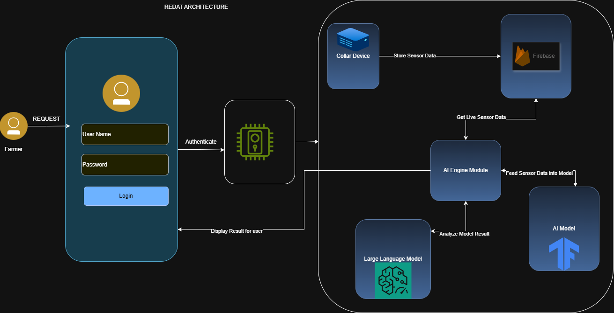

# 🐪 REDAT: Smart Camel Farming & Predictive Health System

[](https://reactnative.dev/)
[](https://react.dev/)
[](https://fastapi.tiangolo.com/)
[](https://deepmind.google/technologies/gemini/)
[](https://catboost.ai/)
[](#)

> **REDAT** (meaning "reclaiming" or "guiding back" in local dialect) is a state-of-the-art smart agriculture and predictive health platform designed for camel farmers in the UAE and wider Gulf region. By integrating real-time **IoT collar telemetry**, custom-trained **Machine Learning classifiers**, and **Generative AI models**, REDAT revolutionizes traditional livestock management, turning reactive veterinary care into proactive, data-driven herd conservation.

---

## 📌 Project Overview
Camels are not only deeply intertwined with the cultural heritage of the UAE, but they are also highly valuable livestock assets. Traditional farming methods rely heavily on visual inspections, meaning illnesses, heat stress, or injuries are often detected only after they become critical. 

REDAT bridges the gap between historical heritage and modern technology:
1. **Wearable IoT Telemetry**: Camels wear smart collars that measure vitals, ambient environment, and coordinates.
2. **Edge-to-Cloud Machine Learning**: Collar readings are run through an optimized CatBoost classifier, yielding immediate health state predictions.
3. **Generative Veterinary AI**: Predicted states and herd contextual data are evaluated by **Gemini 3.5 Flash** to provide instant Arabic and English advisory notes and instructions to farmers.
4. **Cooperative Geolocation Network**: Farmers can report water wells, grazing quality, loose wire hazards, and local disease outbreaks on a shared map, fostering collaborative security.

---

## 🏗️ System Architecture

The following diagram illustrates how REDAT coordinates IoT telemetry, cloud databases, predictive machine learning classifiers, and generative AI models to deliver real-time insights to the farmer.



### 🔄 Architectural Flow & Data Pipeline
1. **The Telemetry Stream (Collar to Firebase)**:
   * The **Collar Device** placed on the camel continuously measures real-time physical telemetry: Body Temperature, Ambient Temperature, Activity Level (accelerometer), Heart Rate, Movement Speed, Humidity, Water Intake, and GPS Coordinates.
   * Telemetry is uploaded in real time and stored securely in the **Firebase Realtime Database**.
2. **Prediction Pipeline (AI Engine Module - FastAPI Backend)**:
   * The **FastAPI Backend** acts as the orchestrator. When telemetry changes, the backend retrieves the live sensor data from Firebase.
   * **Feature Engineering**: The raw data undergoes rapid processing to construct features representing critical indicators:
     * **Heat Index**: Combined physiological and ambient thermal loads ($T_{body} + 0.33 \times T_{ambient}$).
     * **Temp-Activity Ratio**: Relates body temperature to physical exertion.
     * **Hydration Stress**: Ambient temperature scaled against water intake rate.
     * **Mobility Score**: Travel distance multiplied by active hours.
     * **Fever & Ambient Flags**: Binary warning thresholds ($T_{body} > 40.0^\circ\text{C}$).
   * **Classification**: These engineered features are fed into our custom-trained **CatBoost Model** (`redat_best_model.pkl`), which classifies the camel’s status into one of four states: `healthy`, `heat_stress`, `low_activity`, or `possible_illness`.
3. **Contextual Analysis (LLM Integration)**:
   * The predicted health state, along with the farm context (active regional alerts, community pins, and full herd stats), is sent to **Gemini 3.5 Flash**.
   * The LLM synthesizes this complex veterinary data and translates it into friendly, actionable advice tailored for the farmer.
4. **User Delivery (Mobile App & Web Dashboard)**:
   * **Authentication**: The farmer logs into the mobile app securely.
   * **Display**: The application queries the FastAPI backend to display real-time camel trajectories, health status predictions, active alerts, and veterinary advice.
   * **Web Console**: Dashboard administrators track the entire agricultural footprint, localized hazard maps, and predictive analytics curves.

---

## 🧠 Machine Learning & Data Science Layer

The machine learning pipeline was researched and validated inside `ai_model_layer/REDAT_SmartLivestock.ipynb` using a dataset of over **10,000 physiological profiles** representing diverse environmental stresses.

### 📊 Dataset Target Distribution
* **`healthy`**: $54.7\%$ (5,600 samples)
* **`heat_stress`**: $20.2\%$ (2,064 samples)
* **`low_activity`**: $14.7\%$ (1,505 samples)
* **`possible_illness`**: $10.4\%$ (1,065 samples)

### 🏆 Model Comparison & Validation Results
We compared several classification algorithms on 5-fold cross-validation. The final selected model was a **CatBoost Classifier** due to its outstanding accuracy and low generalization gap.

| Model | Test Accuracy | F1 Score | Train-Test Gap |
| :--- | :---: | :---: | :---: |
| 🏆 **CatBoost** | **81.51%** | **81.43%** | **4.40%** *(Best Generalization)* |
| **CatBoost (Tuned)** | 81.18% | 80.89% | 18.82% |
| **Random Forest** | 81.05% | 80.93% | 17.59% |
| **XGBoost** | 80.99% | 80.94% | 14.04% |
| **LightGBM** | 80.86% | 80.64% | 18.26% |
| **Decision Tree (Baseline)** | 74.15% | 74.63% | 25.85% |

---

## 📱 Mobile App Features (React Native & Expo)
Designed with a premium dark-mode aesthetic utilizing modern typography (Roboto Mono) and rich micro-interactions, the mobile application provides farmers with critical tools:
* **Dashboard Console**: Weather monitoring (ambient temperature, humidity, UV index, and regional heat indexes) coupled with live herd analytics.
* **Camel Roster**: Expandable health tracking displaying a custom **ProgressRing** showing health scores, unique identifiers, pregnancy statistics, and vet notes.
* **GPS Tracking & Navigation**: Real-time geolocation of collars relative to home base, displaying distance and prompting direct navigation routes.
* **Community Pin Board**: Interactive map letting farmers add pins about:
  * 💧 **Water Wells** (depth, pump status)
  * 🌾 **Prime Grazing areas** (good grass after rain)
  * ⚠️ **Loose Wire Hazards** (damaged fencing)
  * 🦠 **Disease Outbreaks** (regional camel pox warning)
* **REDAT Intelligence Chat**: Live conversational chatbot that automatically consumes farm context so farmers can ask questions in English or Arabic (e.g., *"Why is Noor's(Noor is camel name) temperature rising?"*).

---

## 💻 Web Dashboard Features (Vite & React)
A powerful tool for herd managers and local agricultural authorities:
* **Herd Overview**: Detailed breakdown of counts (healthy vs. sick/pregnant/heat stress).
* **Live Camel Tracking Map**: Visual markers tracking movement speed and battery telemetry.
* **AI Risk Heatmap**: Real-time risk modeling showcasing regions with high ambient hazard concentrations.
* **Predictive Analytics**: Graphical reports plotting temperature vs. activity over time.
* **Central Alert Hub**: Instantly registers critical-severity predictions generated by the CatBoost classifier.

---

## 🛠️ Technology Stack
* **Mobile Client**: `React Native (Expo)`, `React Navigation`, `Zustand` (State Management), `React Query` (Caching), `React Native Maps`.
* **Web Client**: `React 19`, `Vite`, `Tailwind CSS`, `Recharts` (Visual Analytics).
* **AI & Backend Layer**: `FastAPI` (Python API framework), `Uvicorn`, `CatBoost` / `XGBoost` / `Scikit-Learn`, `Google Generative AI SDK`, `Joblib`, `Pandas`, `Python-Dotenv`.
* **Database & Auth**: `Firebase Realtime Database` & `Firebase Auth`.

---

## 🚀 Installation & Setup

### ⚙️ Prerequisites
Ensure you have the following installed on your system:
* [Node.js](https://nodejs.org/) (v18 or higher)
* [Python](https://www.python.org/) (v3.10 or higher)
* NPM or Yarn

---

### 📡 1. AI Backend Layer & ML Server
Navigate to the `ai_model_layer` directory to start the predictive inference server:

```bash
# Navigate to backend directory
cd ai_model_layer

# Create a virtual environment
python -m venv venv
# Activate virtual environment
# Windows:
.\venv\Scripts\activate
# macOS/Linux:
source venv/bin/activate

# Install dependencies
pip install -r requirements.txt
```

Create a `.env` file inside `ai_model_layer`:
```env
GEMINI_API_KEY=your_gemini_api_key_here
```

Start the FastAPI development server:
```bash
uvicorn main:app --reload --port 8000
```
The server will start at `http://127.0.0.1:8000`. You can access automated Swagger documentation at `http://127.0.0.1:8000/docs`.

---

### 📱 2. Mobile App (Expo Client)
From the root project directory:

```bash
# Install mobile dependencies
npm install

# Start the Expo bundler
npm run start
```
Use the **Expo Go** application on iOS or Android to scan the generated QR code, or press `a` for Android Emulator / `i` for iOS Simulator.

---

### 💻 3. Web Dashboard
Navigate to the web dashboard directory:

```bash
# Navigate to dashboard
cd web-dashboard

# Install dashboard dependencies
npm install

# Start Vite server
npm run dev
```
The web dashboard will open locally at `http://localhost:5173`.

---
*Developed with 🐪 passion for the Tatweer Hackathon 2026. Enabling the next generation of smart desert agriculture.*